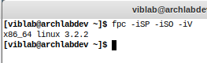
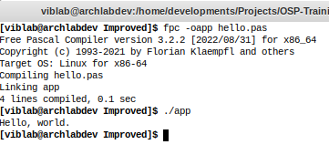
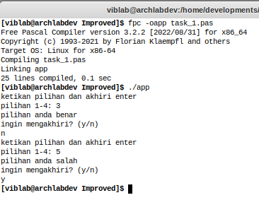

# Notes

This is improved version of old works.

---

## Contents
- [Installation](https://github.com/mekatronik-achmadi/OSP-Training/tree/master/Improved#installation)
- [Compiling](https://github.com/mekatronik-achmadi/OSP-Training/tree/master/Improved#compiling)
- [Results](https://github.com/mekatronik-achmadi/OSP-Training/tree/master/Improved#results)

---

## Installation

This improved version runs on GNU/Linux based operating system using Free Pascal Compiler (FPC).
This method also applicable on Windows through MSYS2 packages distribution.

To install FPC on ArchLinux or its derivative like Manjaro, Parabola, etc, (including MSY2):

```sh
sudo pacman -S fpc
```

To install FPC on Debian or its derivative like Spiral, Ubuntu, etc:

```sh
	
sudo apt-get install fpc
```

You may also use Pascal IDE such as Lazarus for more Delphi-like features.



For this work, as everything done in Bash on Arch-Linux, it use VIm editor


---

## Compiling

Here some basic Pascal example saved as **hello.pas**:

```delphi
program Hello;
begin
  writeln ('Hello, world.');
end.
```

Then, run compiler program:

```sh
fpc -oapp hello.pas
```

It will compile the source into program named **app**.
Then you can test the output program.

```sh
./app
```



---

## Results

Here result screenshot of each programs

### Task 1




